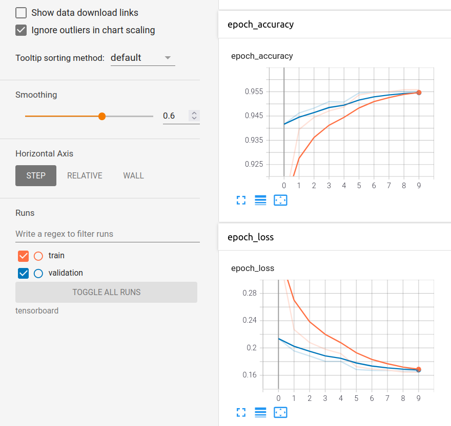

 <h1 align="center">QuickDraw - AirGesture</h1>

## Introduction

Here is my python source code for QuickDraw - an online game developed by google, combined with AirGesture - a simple gesture recognition application. By using my code, you could: 
* **Run an app which you could draw in front of a camera with your hand (If you use laptop, your webcam will be used by default)**
* **Run an app which you could draw on a canvas**

## Camera app
In order to use this application, you only need to use your hand to draw in front of a camera/webcam. The middle point of your hand will be detected and highlighted by a red dot. When you are ready for drawing, you need to press **space** button to start drawing. When you want to stop drawing, press **space** button again.
Below is the demo by running the sript **camera_app.py**:

   
  <i>Camera app demo</i>

## Drawing app
The script and demo will be released soon

## Categories:
The table below shows 18 categories my model used:

|           |           |           |           |
|-----------|:-----------:|:-----------:|:-----------:|
|   apple   |   book    |   bowtie  |   candle  |
|   cloud   |    cup    |   door    | envelope  |
|eyeglasses |   hammer  |    hat    | ice cream |
|   leaf    | scissors  |   star    |  t-shirt  |
|   pants   |    tree   |           |           |

## Trained models

You could find my trained model at **data/trained_models/**

## Docker

For being convenient, I provide Dockerfile which could be used for running training phase as well as launching application

Assume that docker image's name is qd_ag. You already clone this repository and cd into it.

Build:

`sudo docker build --network=host -t qd_ag .`

Run:

If you want to launch the application, first you need to run `xhost +` to turn off access control (if you only want to run the training, you could skip this step). Then you run:

`sudo docker run --gpus all -it --rm --volume="path/to/your/data:/workspace/code/data -e DISPLAY=$DISPLAY --env="QT_X11_NO_MITSHM=1" -v /tmp/.X11-unix:/tmp/.X11-unix --device=/dev/video0:/dev/video0 qd_ag`

Inside docker container, you could run **train.py** or **camera_app.py** scripts for training or launching app respectively. By default, the **camera_app.py** script will automatically generate a video capturing what you have done during the session, at **data/output.mp4**

## Experiments:

For each class, I split the data to training and test sets with ratio of 8:2. The training/test loss/accuracy curves for the experiment are shown below:

 
